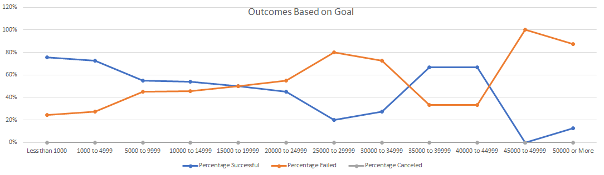

# Kickstarting with Excel

## Overview of Project
---
This analysis seeks to find the relationship between campaign outcomes based on their launched dates and their funding goals to help Louise(client) have a better understanding of theater campaigns fundraising behavior. 

The project consists in two technical analysis using Microsoft Excel to outline relevant insights and communicate them through pertinent visualizations. 

---

## Analysis and Challenges
### Analysis of Outcomes Based on Launch Date

For the first part of the analysis, pivot tables and graphing in Excel were used to visualize theater campaign outcomes based on launched date. As our client is mostly interested in this category.

Before creating the pivot table, an additional column “Years” was added to the Kickstarter sheet. This column extracted the year from the “Date Created Conversion column”. The pivot table was created using “Parent Category” and “Years” as filter, “Date Created Conversion” as rows, “Outcomes” as columns and values. 

The resulting pivot table can be found in the Theater Outcomes by Launched Date sheet and is also shown below. To have the data by month it was necessary to group the rows label into the time of months only. 

Afterwards a line chart was created to visualize the relationship between outcomes and launched month. The result is shown as follows: 

### Analysis of Outcomes Based on Goals

For the second analysis, ranges and formulas such as countifs() were used to analyze the relationship between the outcomes and the goals. The first step was to create a new table that contained different ranges for the goal with its respective number of successful, failed and canceled campaigns, as well as the percentage for each outcome. The countifs() formula was used to fill up the table with the necessary values.

The resulting chart is shown next:

### Challenges and Difficulties Encountered

The main challenge encountered during the first analysis was the need to look up for different formulas in the web in order to complete succeessfully with the requierements needed. For example; how to use the years() formula in excel and how to group rows of a pivot table by months. 

For the second analysis, the greatest difficulty was to make sure that every countif() formula contained the correct range of values for the goal. This was a quite tedious task, but when finished, I realized that a possible solution to this problem was to reference the values to a specific cell rather than to introduce each range manually. This could have saved a lot of time.

Besides the technical analysis challenges encountered, I consider that the most complex task of all is interpreting data results and learning how to use this information wisely.

---
## Results

The main conclusions from the Outcomes based on Launch Date are listed below:

* The month that launched the most successful campaign in the theather category is May. 
* Both failed and successful campaigns seem to follow a similar pattern. However successful campaign have higher outcomes compared to failed ones.
* The total succesful campaigns represent 61%, failed campaigns 36% and canceled only 3%. Which can be a good indicator than there is a higher probability that a campaign can succed, however it is not granted.

The main conclusions from the Outcomes based on Goals are:
* For campaings with a goal below $15000 the percentage of successful campaings is always greater than the percentage of failed campaings. However for campaings with a goal range between $15000 to $19999 the percentage of successful and failed campaings is 50% for both cases. 
* The percentage of failed campaings is higher for goal range between $20000 to $34999, as well as for campaings form $45000 and more. 
* There are no canceled campaings in the category of plays in any of the different goal ranges. So based on the dataset, plays campaings are not commonly canceled.
* Most of the campaings regarding plays have a goal between $1000 and $4999. This information can be useful when planning the required budget. 

What are some limitations of this dataset?

* Dataset does not contain a dictionary that describes what does each colum represents.
* Eventhough the dataset used is quite large, when filtering for theater campaings the dataset reduce substantially, and we end up with fewer data to analyze.

What are some other possible tables and/or graphs that we could create?

In order to present a more complete analysis to our client, we could create new tables to analyze different relationships:
* relationship between outcomes based on the country it was launched- this could help Louise decide the best place to launch her campaing
* relationship between outcomes and the backers involved- does having more backers garantee more successful campains
* relationship between categories and the average donation- which category has the highest average donation, and how well position is the category of theater ranked
* relationship between the time it took for the campaigns to fully fund themself and the amount of money raised- does campaings that took longer time raised more money
